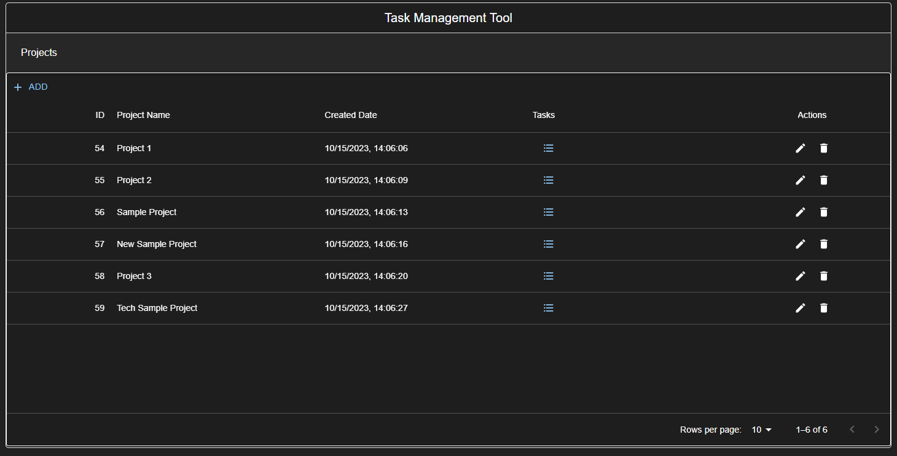
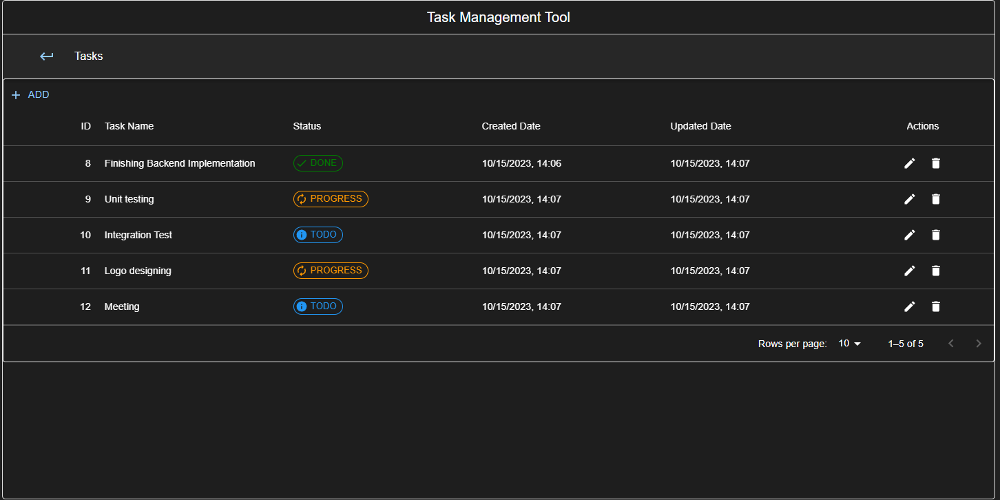
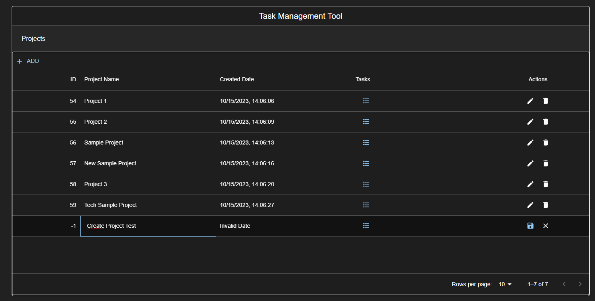
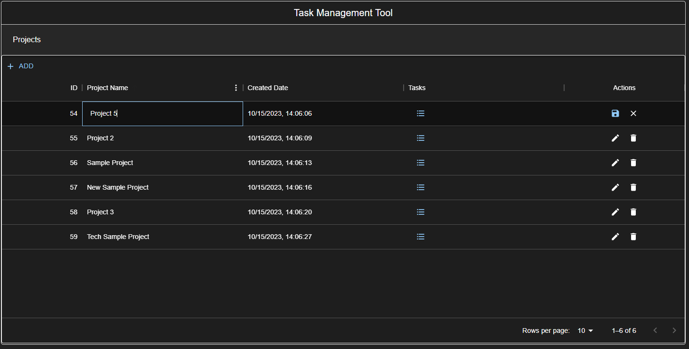
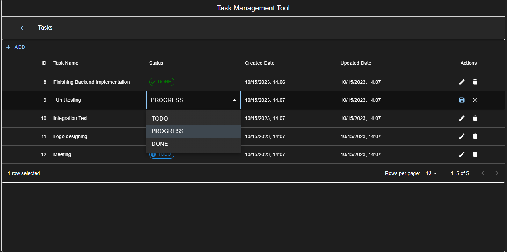
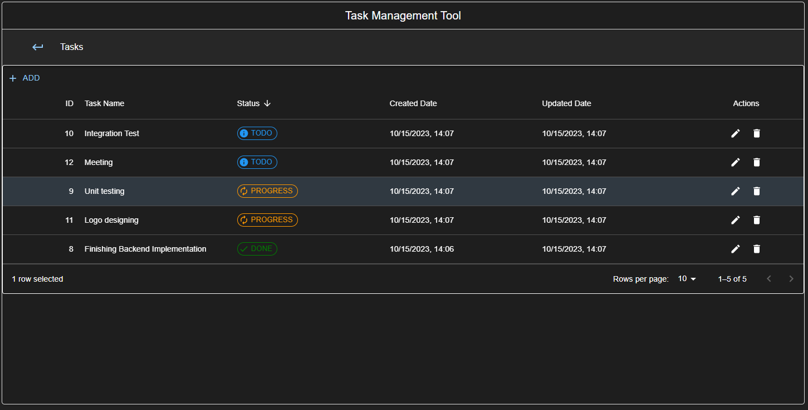

 

  

  <h3 align="center">Task Management Tool</h3>

  

    A simple tool which people can plan their project workflow more easily.
     
     
  

    
    
    
    

  
  
  
  
  

## Table Of Contents

* [About the Project](#about-the-project)
* [Built With](#built-with)
* [Getting Started](#getting-started)
  * [Prerequisites](#prerequisites)
* [Usage](#usage)
* [Roadmap](#roadmap)
* [Contributing](#contributing)
* [Authors](#authors)

## About The Project

Task Management Tool is a very basic and new application which currently contains simple features. People can manage their daily or project based tasks easily.

I also know that, there are tons of applications or tools which are more useful and effective from this project. 
_The main purpose of this project to do practice on Springboot and React frameworks._

* Lightweight
* Easy to use
* Easy to understand

## Getting Started

If you would like to run this project, you need to follow these steps

### Normal Run
___

#### 1. Server
> Enter these commands in /server folder
`
    mvn clean install
`
`
    mvn spring-boot:run
`

#### 2. Client
> Enter these commands in /client folder
`
    yarn
`
`
    yarn start
`

### Docker Run
___
`
    docker-compose build
`
`
    docker-compose up -d
`

### Prerequisites

You need to have at least
* Java 17
* Node 16
* Maven 3.9
## Usage

Currently, Task Management Tools contains very limited features but it still can be useful.
Users can basically can do these actions on the application
* Create Project / Task
* Update Project / Task
* List Projects / Tasks
* Delete Project / Task
* Order Project / Task

__Create Project__

__Update Project__

__Update Task__

__Order Tasks Based on *Status*__

## Roadmap

See the [open issues](https://github.com/barispinara/TaskManagementTool/issues) for a list of proposed features (and known issues).

## Contributing

Contributions are what make the open source community such an amazing place to be learn, inspire, and create. Any contributions you make are **greatly appreciated**.
* If you have suggestions for adding or removing projects, feel free to [open an issue](https://github.com/barispinara/TaskManagementTool/issues/new) to discuss it, or directly create a pull request after you edit the *README.md* file with necessary changes.
* Please make sure you check your spelling and grammar.
* Create individual PR for each suggestion.

### Creating A Pull Request

1. Fork the Project
2. Create your Feature Branch (`git checkout -b feature/AmazingFeature`)
3. Commit your Changes (`git commit -m 'Add some AmazingFeature'`)
4. Push to the Branch (`git push origin feature/AmazingFeature`)
5. Open a Pull Request

## Authors

* **Baris PINAR** - *Backend Developer* - [Baris Pinar](https://github.com/barispinara) - *Task Management Tool*
